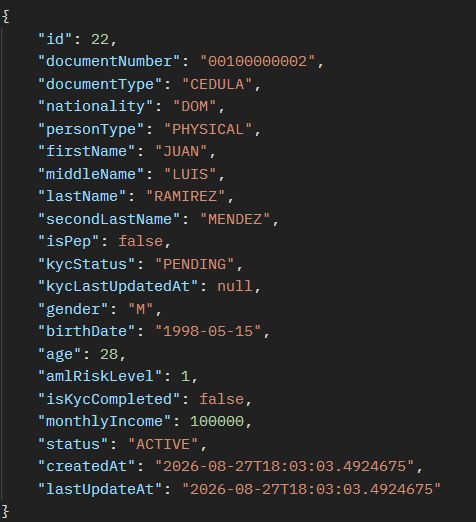
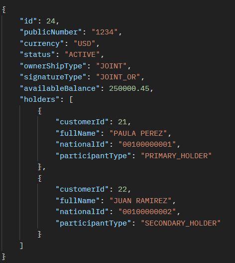
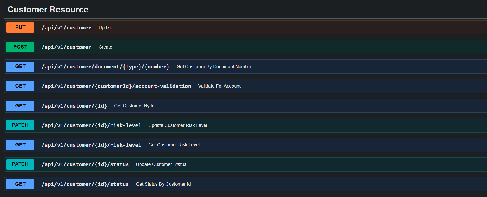
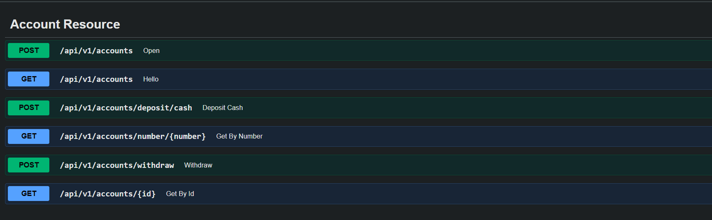

# 🏦 Quarkus Bank Microservices

Sistema de microservicios bancarios construido con **Quarkus** y **Java 17+**, diseñado para operaciones financieras de alto rendimiento y baja latencia.

---

## 🛠️ Tech Stack

* **Framework:** Quarkus
* **Lenguaje:** Java 21
* **Base de Datos:** Oracle DB
* **Documentación:** Swagger / OpenAPI

---

## 📸 Demostración / Respuestas de la API

### 1. Gestión de Clientes
> Ejemplo de respuesta al consultar la información de un cliente:



---

### 2. Gestión de Cuentas
> Ejemplo de respuesta al consultar la información de una cuenta bancaria:



---

### 4. Documentación con Swagger UI
> Interfaz interactiva para probar los endpoints del sistema:




---

**Clonar el repositorio:**
   ```bash
   git clone [https://github.com/EdwardDiazR/quarkus-bank-microservices.git](https://github.com/EdwardDiazR/quarkus-bank-microservices.git)
   cd quarkus-bank-microservices
